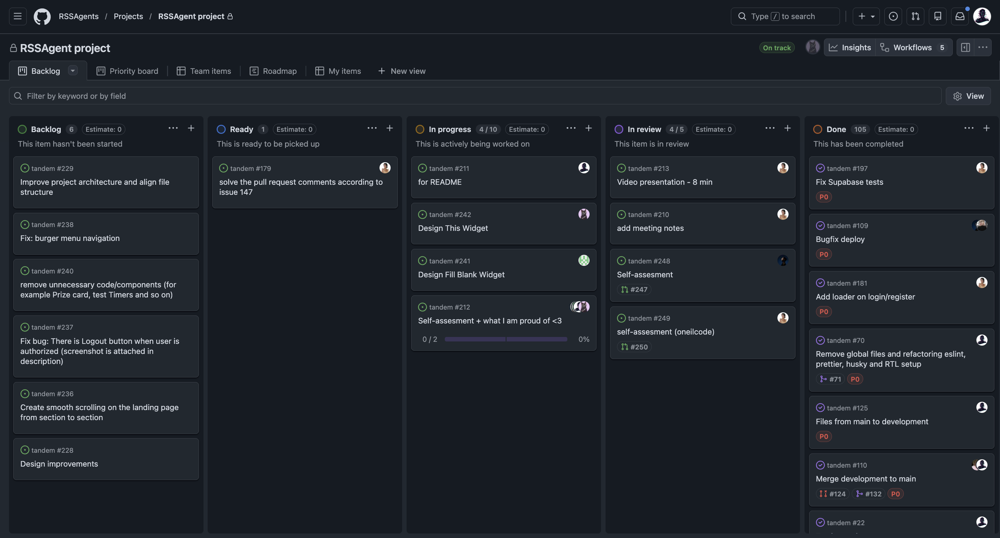

# RS JS/FE Final Project: Tandem - SPA Application

**Tandem** is an interactive platform designed to help developers prepare for technical interviews and practice hard skills (JavaScript, TypeScript, Algorithms) through quizzes and coding challenges.

## 📚 Documentation

- [Getting Started](docs/getting-started.md)
- [Development Workflow](docs/workflow.md)
- [Project Structure](docs/structure.md)

## 👥 Team - RSSAgents

This project was developed by the RSSAgents team as part of the RS School JS/FE course:

| Role                   | Name      | GitHub                               |
| ---------------------- | --------- | -------------------------------------|
| **Team Lead - Mentor** | Shakhzod  | (https://github.com/Shakhzod235)     |
| **Mentor**             | Diana     | (https://github.com/bt-diana)        |
| **Mentor**             | Khayitbek | (https://github.com/Khayitbek03)     |
| **Mentor**             | Daria     | (https://github.com/dashque)         |
| **Mentor**             | Margarita | (https://github.com/Margaryta-Maletz)|
| **Developer**          | Fayzullo  | (https://github.com/Fayzullo05)      |
| **Developer**          | Ilia      | (https://github.com/D15ND)           |
| **Developer**          | Margarita | (https://github.com/solarsungai)     |
| **Developer**          | Marta     | (https://github.com/27moon)          |
| **Developer**          | Vika      | (https://github.com/oneilcode)       |

## 🏗️ Tech Stack

- **Frontend** | React, TypeScript
- **Design System** | Mantine
- **Routing** | React Router DOM
- **Forms** | React Hook Form
- **State Management** | Redux Toolkit
- **Backend** | Node.js, Fastify
- **Database & Auth** | Firebase / Supabase
- **Build Tool** | Vite
- **Code Quality** | ESLint, Prettier, Husky
- **Testing** | Unit tests (React Testing Library), End-to-end tests (Cypress), Vitest
- **CI/CD** | GitHub Actions (Dev → Staging, Main → Production)
- **API Client** | Axios

## 📈 Task Tracking

- Development progress is managed via [GitHub Projects](https://github.com/orgs/RSSAgents/projects/1/views/1).
- Development Diary - https://github.com/rolling-scopes-school/tasks/blob/master/stage2/tasks/rs-tandem/DEVELOPMENT_DIARY.md

## 🚀 Deployment

For deployment, the project will use Vercel.

🔗 **Ссылка на проект:** [Tandem](https://tandem-three.vercel.app/)

## 🚀 Checkpoint week 5🔗

**Ссылка на видео:** [checkpoint-5](https://youtu.be/Wa8RyWGipxc)

## 💣 Checkpoint week 7🔗

**Ссылка на видео:** [checkpoint-7](https://www.youtube.com/watch?v=A4Hip18og64)

**Чем гордимся:**

- Современный стек технологий
- Менторская поддержка (старт с архитектурой, фидбеки и ревью ПР)
- Использовали дизайн-систему Mantine - это позволило использовать готовые компоненты «из коробки» без необходимости самостоятельной реализации, а через провайдер темы настроили единое управление цветом, который автоматически применяется ко всем блокам
- Реализована регистрация с подтверждением email - пользователь получает письмо с работающей ссылкой для активации аккаунта
- Настроили интеграцию с Supabase для авторизации, а данные для виджетов загружаются динамически при каждом рендере
- Автоматизировали контроль качества: при каждом коммите срабатывают хуки (ESLint, Prettier, typecheck, unit и E2E тесты), а в GitHub Actions настроены CI/CD-проверки
- Обеспечили качество кода через тестирование: unit-тестами покрыли большинство компонентов, а E2E-тесты проверяют ключевую пользовательскую логику
- Реализовали полную интернационализацию проекта с поддержкой русского и английского языков
- Мы справились со всеми поставленными задачами: все компоненты интегрированы, все фичи реализованы - перед нами полноценный, завершённый проект

**Участники и ссылки на дневники:**

- Fayzullo (Fayzullo05): [notes](https://github.com/RSSAgents/tandem/tree/main/development-notes/fayzullo05)
- Ilia (D15ND): [notes](https://github.com/RSSAgents/tandem/tree/main/development-notes/D15ND)
- Margarita (solarsungai): [notes](https://github.com/RSSAgents/tandem/tree/main/development-notes/solarsungai)
- Marta (27moon): [notes](https://github.com/RSSAgents/tandem/tree/main/development-notes/27moon)
- Vika (oneilcode): [notes](https://github.com/RSSAgents/tandem/tree/main/development-notes/oneilcode)

**Доска (ссылка и скриншот):**

- [Board](https://github.com/orgs/RSSAgents/projects/1/views/1)

**Лучшие ПР:**

- [PR 1](https://github.com/RSSAgents/tandem/pull/215)

- [PR 2](https://github.com/RSSAgents/tandem/pull/50#event-23056591936)

- [PR 3](https://github.com/RSSAgents/tandem/pull/156#event-23613878422)

**Meeting notes:**

- [22.02.2026](docs/meeting-notes/22.02.2026/note.md)
- [07.03.2026](docs/meeting-notes/7.03.2026/note.md)
- [14.03.2026](docs/meeting-notes/14.03.2026/note.md)
- [26.03.2026](docs/meeting-notes/26.03.2026/note.md)
- [04.04.2026](docs/meeting-notes/4.04.2026/note.md)

**Self-assessment PR:**

