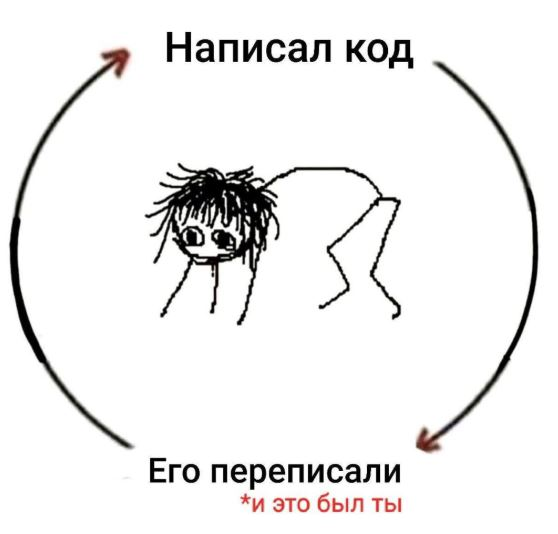

# Self-Assessment

**Ссылка на PR:** [PR#250](https://github.com/RSSAgents/tandem/pull/250)

## Personal Features

| Категория        | Фича и PR                                                                                                                                                                  | Баллы |
| ---------------- | -------------------------------------------------------------------------------------------------------------------------------------------------------------------------- | ----- |
| My Components    | Console Widget: (Виджет): [PR#103](https://github.com/RSSAgents/tandem/pull/103)                                                                                           | 25    |
| My Components    | Point system (Прогресс улитка за ИИ-интервью + общее количество баллов): [PR#208](https://github.com/RSSAgents/tandem/pull/208)                                            | 25    |
| Backend & Data   | BaaS CRUD (получение с сервера участников для таблицы победителей с сортировкой по количеству баллов): [PR#233](https://github.com/RSSAgents/tandem/pull/233)              | 15    |
| Game             | Leaderboard (Таблица победителей): [PR#155](https://github.com/RSSAgents/tandem/pull/155), [PR#223](https://github.com/RSSAgents/tandem/pull/223)                          | 5     |
| UI & Interaction | Drag & Drop: [PR#103](https://github.com/RSSAgents/tandem/pull/103)                                                                                                        | 10    |
| UI & Interaction | Theme Switcher: [PR#82](https://github.com/RSSAgents/tandem/pull/82)                                                                                                       | 10    |
| UI & Interaction | Advanced Animations (анимация scale на главной странице сайта, анимация прогресс-улитки, ховер-эффекты на кнопках виджета, анимация символа звездочки для баллов)          | 10    |
| UI & Interaction | i18n (Перевод своих компонентов, страницы О нас, сайдбара): [PR#191](https://github.com/RSSAgents/tandem/pull/191), [PR#232](https://github.com/RSSAgents/tandem/pull/232) | 10    |
| UI & Interaction | Responsive: [PR#162](https://github.com/RSSAgents/tandem/pull/162)                                                                                                         | 5     |
| Quality          | Unit Tests (Basic)                                                                                                                                                         | 10    |
| Architecture     | Design Patterns                                                                                                                                                            | 5     |
| Architecture     | API Layer                                                                                                                                                                  | 10    |
| Frameworks       | React                                                                                                                                                                      | 5     |

**Итоговая оценка:** 145/250

---

## Дополнительные фичи, которых нет в критериях

#### 🎨 Design - Landing Page (Главная страница)

Дизайн и реализация главной страницы приложения, разделенной на секции:

| Секция                             | Описание                                      |
| ---------------------------------- | --------------------------------------------- |
| 🚀 **Hero**                        | Главный экран с призывом к действию           |
| 📚 **С чего начать?**              | Пошаговое руководство для новых пользователей |
| 🎯 **Кому подойдет**               | Целевая аудитория проекта                     |
| 🧩 **Информация о виджетах**       | Обзор доступных обучающих виджетов            |
| 🤖 **Информация об ИИ-ассистенте** | Описание возможностей AI-помощника            |
| 🏆 **Таблица лидеров**             | Рейтинг пользователей                         |
| ❤️ **Преимущества Tandem**         | Почему разработчики любят Tandem              |
| ❓ **Вопросы и ответы (FAQs)**     | Часто задаваемые вопросы                      |

**🌐 Языковая поддержка:**
Landing page полностью поддерживает **русский** и **английский** языки (i18n)

🔗 [Pull Request #165](https://github.com/RSSAgents/tandem/pull/165)

---

#### 🧩 UI Kit

Создана библиотека базовых компонентов для использования во всем приложении:

| Компонент           | Назначение                              |
| ------------------- | --------------------------------------- |
| `Header`            | Верхняя навигационная панель            |
| `Footer`            | Нижний колонтитул сайта                 |
| `PageLoader`        | Индикатор загрузки страницы             |
| `ErrorDisplay`      | Отображение ошибок с понятным UI        |
| `ResultDisplay`     | Показ результата проверки с объяснением |
| `ScoreDisplayModal` | Модальное окно с итоговым счетом        |

#### 🎯 2 личных Feature Component

### 1. Console Widget 🖥️

> **Интерактивный обучающий виджет с механикой Drag & Drop сортировки**

**Назначение:**
Проверка знаний пользователя в формате _"расположи вывод console.log в правильном порядке"_

#### Возможности виджета:

| Функция                       | Описание                                                               |
| ----------------------------- | ---------------------------------------------------------------------- |
| 📄 **Отображение задания**    | Показывает фрагмент кода, который нужно проанализировать               |
| 🔄 **Drag & Drop сортировка** | Пользователь перетаскивает элементы в правильном порядке               |
| ✅ **Проверка результата**    | После ответа - можно узнать правильность ответа                        |
| 📖 **Обучение**               | При **любом** ответе (правильном/неправильном) показывается объяснение |
| ⭐ **Подсчет очков**          | Сохраняет результат и показывает модальное окно с итоговым счетом      |
| 🌐 **Мультиязычность**        | Полная поддержка переводов через i18n                                  |

---

### 2. Point System (Балльная система) ⭐

> **Система начисления и отображения баллов пользователя**

🔗 [Pull Request #223](https://github.com/RSSAgents/tandem/pull/223)

#### Компоненты системы:

#### A. SidebarSnailProgress 🐌 — прогресс AI-агента

| Характеристика           | Описание                                                         |
| ------------------------ | ---------------------------------------------------------------- |
| 📊 **Отображение**       | Процент готовности пользователя для интервью с помощиб AI-агента |
| 🎨 **Визуализация**      | Компонент ProgressBar с **движущейся улиткой**                   |
| 🔢 **Диапазон**          | 0–100% (автоматическое ограничение)                              |
| 📱 **Компактная версия** | Используется в таблице лидеров - немного в компактной версии     |

---

#### B. SidebarScoreInfo ℹ️ — информация о баллах

Показывает пользователю, **как заработать баллы**:

| Действие                             | Начисление баллов                                                                |
| ------------------------------------ | -------------------------------------------------------------------------------- |
| ⭐ **Прохождение виджета**           | + баллы за правильные ответы                                                     |
| ⭐ **Прохождение ИИ-собеседования**  | + баллы за правильные ответы + идет отдельный прогресс по ИИ-интервью            |
| ⭐ **Повторное прохождение виджета** | ❌ Не дает дополнительных баллов ✅ Учитывается **самый последний результат** |
| ⭐ **Изучение материалов**           | +1 балл за посещение страницы **"База знаний"** ⏰ Не более 1 балла в сутки   |

---

#### C. UserBlock 👤

| Функция             | Описание                                                                                                                                                     |
| ------------------- | ------------------------------------------------------------------------------------------------------------------------------------------------------------ |
| ⭐ **Текущий счет** | Отображение общего количества набранных баллов в сайдбаре окоо аватара пользователя + на странице Таблица лидеров отображаются баллов первых 10-ти чемпионов |

##### Используемые технологии:

React | TypeScript | @dnd-kit | Mantine UI | React i18next

---

Как это было:

