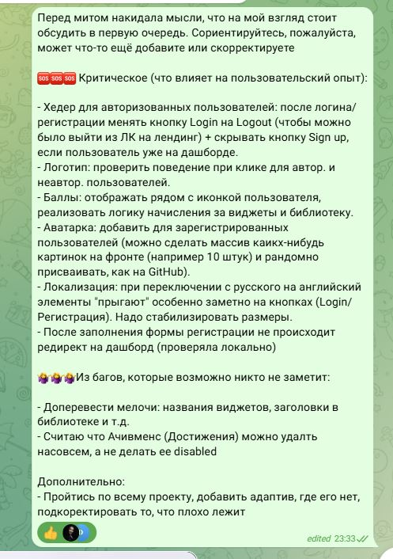

# Дата: 2026-03-26

**Тип мита:** Нерегулярный синк (не входит в число обязательных регулярных)
**Участники:** Присутствовали только студенты проекта: @27moon (Марта), @D15ND (Илья), @fayzullo05 (Файзулло), @solarsungai (Маргарита), @oneilcode (Вика)
**Длительность:** 30 минут

#### 1. Что обсуждали

- Обсудили текущий прогресс по проекту, обозначили приоритетные задачи

#### 2. Какие проблемы были

- Перед митом, в группе Телеграм обсудили критические задачи, баги и дополнительные (но необязательные улучшения):

  

#### 3. Принятые решения + ответственные

- распределили задания до следующего группового мита (см скрин с ТГ канала)

