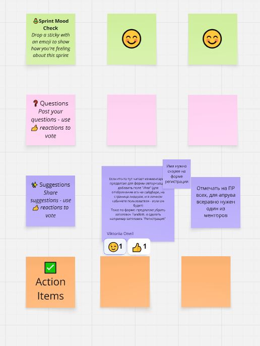

# Дата: 2026-03-07

**Тип мита:** Регулярный синк
**Участники:** @Margaryta-Maletz (Маргарита), @Shakhzod235 (Шахзод), @bt-diana (Диана), @dashque (Даша), @27moon (Марта), @D15ND (Илья), @fayzullo05 (Файзулло), @solarsungai (Маргарита), @oneilcode (Вика)
**Длительность:** 1ч 40мин

#### 1. Что обсуждали

Обсудили итоги предыдущей недели:

- Какие задачи закрыты полностью
- Что осталось в работе
- Приоритеты на следующую неделю
- Процесс мержа PR
- Коммуникация в Telegram

#### 2. Какие проблемы были

- В Telegram обсуждения расползались, важные вопросы терялись в переписке
- Не было единого места для сбора вопросов к созвонам → тратили время на вспоминание проблем в начале мита
- Часть задач застряла в статусе «почти готово», но не закрывалась

#### 3. Принятые решения + ответственные

- **Создать доску Miro** - для сбора вопросов и подготовки agenda к созвонам
  → Ответственная: Диана

- **Пинить важные вопросы** - особо важные вопросы закреплять и тегать заинтересованных лиц / тех, чьё мнение нужно автору вопроса

- **Мержить PR перед новым спринтом** - Илья и Даша вечером в воскресенье смерживают:

  - все готовые PR → в `develop`
  - `develop` → в `main`
  - дневники → в `main`

  - **Остальные участники** — занимаются доработкой своих виджетов и текущими задачами

Созданная доска Миро после созвона:

